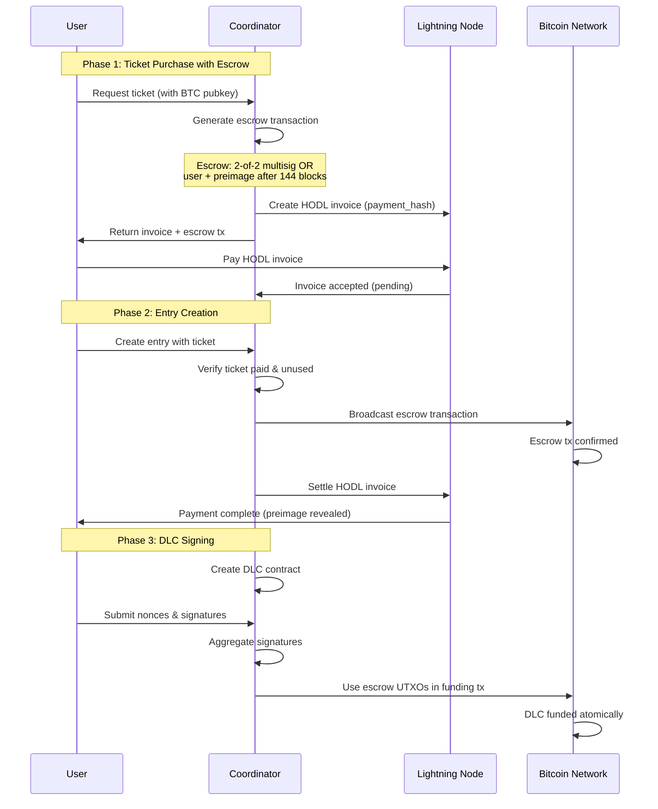
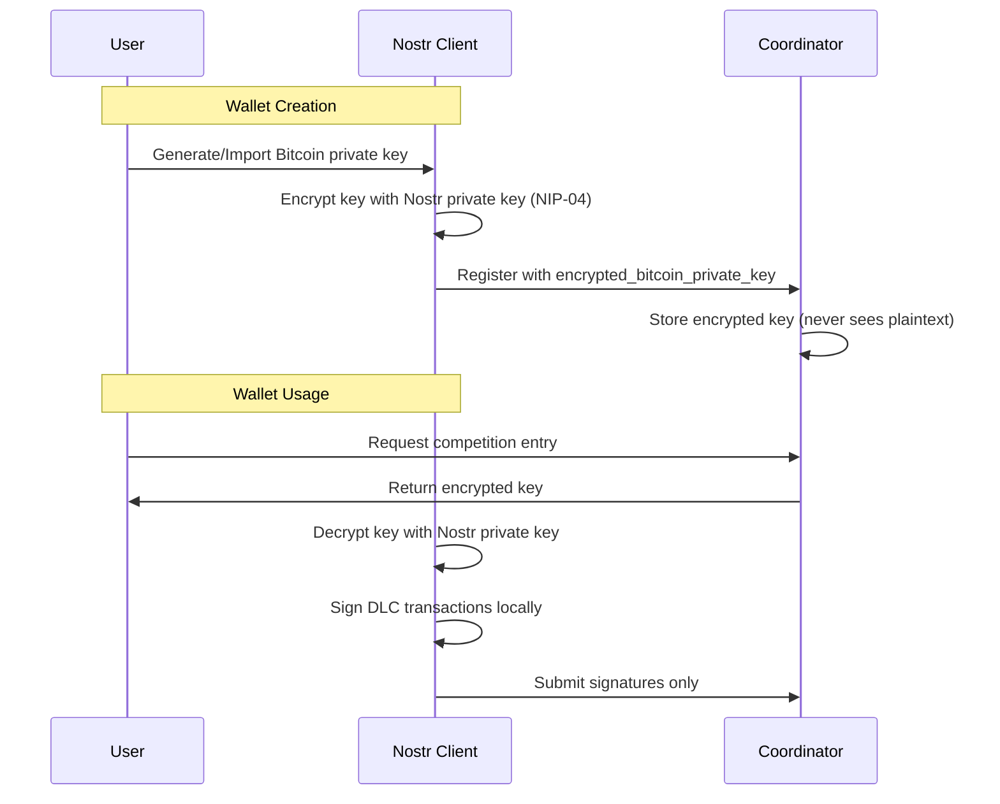
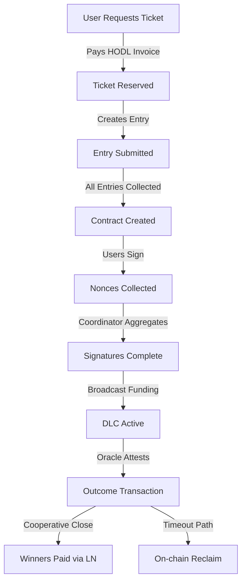

# 5day4cast Coordinator
Holds the MVP of fantasy weather dlctix coordinator - a DLC-based fantasy weather prediction market

## Built With

This project leverages several excellent open-source libraries:
- [dlctix](https://github.com/conduition/dlctix) - Provides the underlying DLC cryptography and protocol implementation
- [bdk_wallet](https://github.com/bitcoindevkit/bdk) - Bitcoin wallet functionality and transaction building
- [nostr-sdk](https://github.com/rust-nostr/nostr) - Nostr protocol implementation for user authentication and encryption
- [duckdb](https://github.com/duckdb/duckdb) - DuckDB for data storage, is a fast, in-process, SQL query engine that supports ACID transactions and is designed for analytics workloads.

## External Services Required

The coordinator requires the following services to be running:
- **[LND](https://github.com/lightningnetwork/lnd)** - Lightning Network node for payment processing
  - Used for creating HODL invoices and processing lightning payments
  - Requires REST API access with invoice macaroon permissions
- **[Esplora](https://github.com/Blockstream/esplora)** - Bitcoin blockchain explorer
  - Used for fee estimation, transaction broadcasting, and confirmation tracking
  - Can use public instances or run your own for better privacy
- **[Oracle](https://www.4casttruth.win/)** - Oracle data provider
  - Used for fetching real-time weather data and dlc attestations
  - Requires API access with authentication credentials (a coordinator's nostr private key)


### Local Development Setup

For local testing, you can use the included [Doppler scripts](.doppler/README.md) to automatically set up a complete Bitcoin regtest environment with:
- Bitcoin Core node
- Multiple LND nodes with pre-established channels
- Esplora block explorer
- Automated block mining

Also make sure to either use the deployed 4casttruth.win or run your own instance.

## Setup

### To compile server add duckdb lib:
```bash
wget https://github.com/duckdb/duckdb/releases/download/v1.0.0/libduckdb-linux-amd64.zip
mkdir duckdb_lib
unzip libduckdb-linux-amd64.zip -d duckdb_lib
sudo cp duckdb_lib/lib*.so* /usr/local/lib/
sudo ldconfig
rm libduckdb-linux-amd64.zip
```

### To compile and add WASM to frontend:
- at the root of the repo run `./build_ui.sh`

### How to run
- at the root of the repo run `cargo run --bin server -- --config ./config/local.toml`

## Architecture Overview

### Competition State Machine

The competition progresses through the following states:

1. **Created** → Initial state when competition is created
2. **EntriesCollected** → When all required entries are paid
3. **EscrowFundsConfirmed** → When all escrow transactions have 1+ confirmations
4. **EventCreated** → When event is successfully created on the oracle
5. **EntriesSubmitted** → When all entries are submitted to the oracle
6. **ContractCreated** → When DLC contract parameters are generated
7. **NoncesCollected** → When all users have submitted their public nonces
8. **AggregateNoncesGenerated** → When coordinator aggregates all nonces
9. **PartialSignaturesCollected** → When all users have submitted signatures
10. **SigningComplete** → When all signatures are aggregated
11. **FundingBroadcasted** → When funding transaction is broadcast
12. **FundingConfirmed** → When funding transaction has 1+ confirmations
13. **FundingSettled** → Depreciated event (to be removed soon)
14. **Attested** → When oracle provides attestation
15. **OutcomeBroadcasted** → When outcome transaction is broadcast
16. **DeltaBroadcasted** → When first delta (cooperative close) transactions are broadcast
17. **Completed** → When all reclaim transactions are broadcast (if needed)

### Atomic Escrow Mechanism

The escrow system ensures atomicity between Lightning payments and on-chain DLC participation:



### Key Properties:
- **Atomic Exchange**: The HODL invoice ensures the coordinator only gets paid if they broadcast the escrow transaction
- **Refund Path**: Users can reclaim funds after 144 blocks using the payment preimage if coordinator misbehaves
- **No Trust Required**: The escrow script enforces the atomic swap cryptographically

### Escrow Script Details:
```
wsh(or_d(
    multi(2, coordinator_pubkey, user_pubkey),  // Cooperative path
    and_v(
        v:pk(user_pubkey),                      // User can spend alone...
        and_v(
            v:sha256(payment_hash),             // ...with payment preimage...
            older(144)                          // ...after 144 blocks
        )
    )
))
```

### User Wallet Key Encryption

The system uses Nostr's NIP-04 encryption standard to secure user wallet keys:



### Security Properties:
- **Client-side Encryption**: Bitcoin private keys are encrypted locally using the user's Nostr key
- **Coordinator Never Sees Keys**: Only encrypted keys are sent to and stored by the coordinator
- **Recovery via Nostr**: Users can recover their DLC wallet using just their Nostr key
- **Standard Encryption**: Uses NIP-04 (ECDH + AES-256-CBC) for interoperability

### Implementation Details:
- Encryption: `nostr_client.nip04_encrypt(coordinator_pubkey, bitcoin_private_key)`
- Storage: `encrypted_bitcoin_private_key` field in user table
- Decryption: Happens only client-side when signing transactions

## Competition Flow



## Error Handling

### The system includes robust error recovery:
- Failed escrow broadcasts trigger HODL invoice cancellation
- Incomplete signing rounds can restart without lost funds
- All state transitions are idempotent
- Failed lightning payouts fall back to on-chain claims
