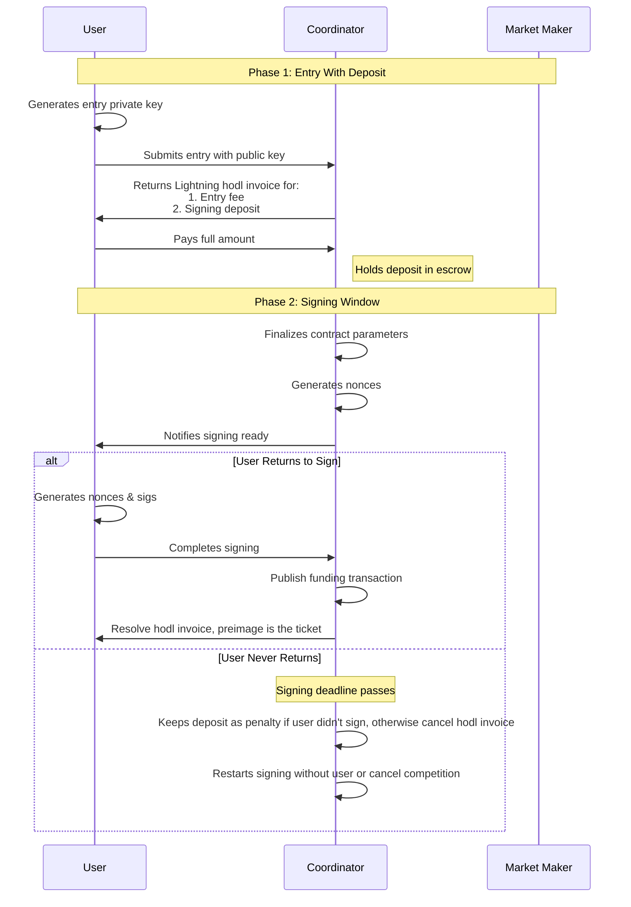

# 5day4cast
Holds the MVP of fantasy weather

### To compile add duckdb lib:
```
wget https://github.com/duckdb/duckdb/releases/download/v1.0.0/libduckdb-linux-amd64.zip
mkdir duckdb_lib
unzip libduckdb-linux-amd64.zip -d duckdb_lib
sudo cp duckdb_lib/lib*.so* /usr/local/lib/
sudo ldconfig
rm libduckdb-linux-amd64.zip
```

### How to run
- at the root of the repo run `cargo run --bin server`

### How transaction creation works

With the Musig signing
1) competition is created (parameters for the DLC contract are created and stored in the coordinator, and sent to the oracle to store)
2) users create an entry into the competition, this entry goes into "pending" state
3) coordinator collects all the pubkeys of users that want to enter into the competition
4) once the coordinator has reached the total number of pubkeys required for the competition (we need to split the contract with all users)
    we generate the musig public key with the coordinator, and all users keys -- (aggregate pubkey)
5) at the point we mark all entries are still set as "pending", every user needs to now sign the aggregate nonce and return back to the coordinator
    -- there is some issues here around UX, how do we insure that a user comes back and does the signing? we need to notify them some how (probably via nostr)

6) once the musig aggregate signature is verified we can now sign the dlc transactions


