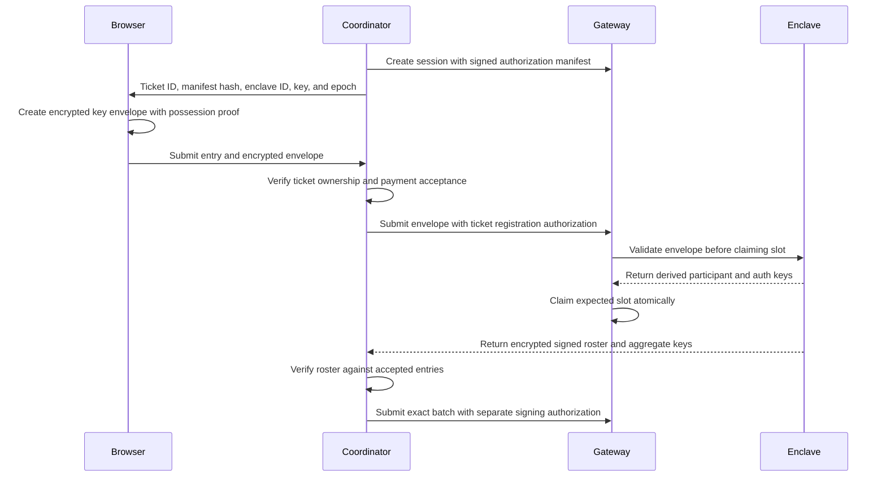

# Keymeld authorization migration

The coordinator uses participant-scoped registration and a separate signing authority before funding Keymeld contracts.
This document records the design behind that integration and the invariants the code enforces.
The [README](../README.md#keymeld-authorization-upgrade) covers operator configuration and the upgrade procedure.

The workspace pins Keymeld security revision `a974207819f24fbfe40c33542f8f19d28e7c4f09` (protocol 0.4) in [Cargo.toml](../Cargo.toml).
Move to the reviewed `v0.4.0` tag when it is released and deploy the gateway and enclaves at the same version.
Complete Keymeld's hardware acceptance checks before using the Nitro deployment.

## Preserve the coordinator model

Coordinator creates sessions before participants select their keys.
Each ticket UUID becomes a Keymeld participant ID.
The browser prepares an encrypted participant key; coordinator submits the registration later.
Coordinator also starts unattended DLC signing.

This sequence is retained. Registration authority and signing authority stay separate from the shared session secret.

| Material | Holder | Purpose |
| --- | --- | --- |
| Participant private key | Browser wallet and assigned enclave | Create participant proofs and MuSig2 signatures |
| Shared session secret | Coordinator and authorized participants | Decrypt session data and authenticate session reads |
| Registration credential for each ticket | Coordinator | Authorize one participant key for that ticket |
| Session signing credential | Coordinator | Authorize the exact DLC signing batch |
| Pinned authorization manifest | Coordinator and authorized participants | Identify permitted slots, subsets, and authority keys |

The shared session secret does not authorize registration or signing.
Do not derive either authority credential from that secret.



## Store the session credentials

[StoredDlcKeygenSession](../crates/coordinator/src/infra/keymeld.rs) retains these values:

- The existing session ID and encrypted shared session secret.
- The pinned `SignedSessionManifest` returned by `authorization_manifest()`.
- The creator-signed enclave recipient proof returned by `recipient_authorization()`.
- The signing credential returned by `authorization_credentials()`.
- Each ticket credential returned by `registration_credentials(&user_id)`.

Private authority credentials are NIP-44 encrypted to the coordinator key before storage.
Persistence uses `AuthorizationCredentials::export_secret()` and `AuthorizationCredentials::from_secret()`.
The pinned manifest lives in the same session record and is never reconstructed from a gateway response.
Restoring a stored record re-verifies the recipient proof and checks every credential against the manifest.

Coordinator signing restores with `restore_session_with_authority(session_id, credentials, manifest, authority)`.
Session reads restore with `restore_session(session_id, credentials, manifest)`.
Both paths reject a gateway that reports different enclave recipients than the pinned proof.

`create_session_with_subsets()` generates independent authority credentials by default.
The method still accepts participant IDs before participant keys exist.
The returned credentials are persisted before any ticket registration context is issued.

## Prepare the participant envelope in WASM

The browser and synth share [coordinator-core's registration module](../crates/coordinator-core/src/keymeld.rs) through [prepare_keymeld_registration](../crates/coordinator-wasm/src/wallet/core.rs).
It passes the complete `RegistrationContext` to `UserCredentials::prepare_registration(context, enclave_public_key)`.
The SDK returns an ECIES envelope containing the key, context, and a versioned possession proof.

The [TicketResponse](../crates/coordinator/src/domain/competitions/coordinator.rs) carries a `RegistrationAssignment` with this context:

| Context field | Source |
| --- | --- |
| `keygen_session_id` | Stored Keymeld session ID |
| `user_id` | Reserved ticket UUID |
| `manifest_hash` | `authorization_manifest().digest()` from the stored manifest |
| `enclave_id` | Assigned participant slot |
| `enclave_key_epoch` | Assigned enclave public-key response |
| `public_key` | Browser wallet's entry key |
| `auth_pubkey` | Existing `derive_session_auth_pubkey()` result |
| `require_signing_approval` | Agreed participant policy; coordinator currently uses `false` |

The authenticated ticket route delivers the session and enclave context.
The submitted context is stored with the encrypted envelope in the `keymeld_registration_context` entry column.
Coordinator needs the exact context when authorizing the registration later.

[entries.js](../crates/coordinator/src/templates/pages/entries/entries.js) passes the assignment into WASM.
[Synth registration preparation](../crates/synth/src/crypto/keymeld.rs) generates the same envelope.

Registration credentials stay on the coordinator during ticket reservation.
Unpaid reservations can be reassigned after ten minutes in [get_and_reserve_ticket](../crates/coordinator/src/domain/competitions/store.rs).
A permanent credential given to an earlier reserver would also authorize the reassigned ticket.

For a future direct-registration flow, deliver an invitation only after ticket ownership becomes final.
`session.invitation(&user_id)` bundles a slot credential with its pinned manifest.
`JoinOptions::invitation(invitation)` supports that flow.

## Authorize the accepted entry

[register_participant](../crates/coordinator/src/infra/keymeld.rs) runs after the accepted entry is validated.
The existing checks for ticket ownership, payment acceptance, and unused entry state remain.

1. Load the stored manifest and that ticket's registration credential.
2. Compare the envelope context with the accepted entry and assigned slot.
3. Call `RegistrationAuthorization::sign(&slot_secret, context, &encrypted_private_key)`.
4. Include the result as `registration_authorization` in `RegisterKeygenParticipantRequest`.
5. Submit the request with the existing session-read authentication header.
6. Treat a rejected registration as a blocking entry error.

The gateway validates the outer authorization and requests enclave validation before claiming the slot.
The enclave verifies possession and derives both public keys from the decrypted private key.
Caller-supplied public keys must match those derived keys.

An accepted slot cannot be replaced.
Unknown participants and registrations outside `CollectingParticipants` are rejected.
The database claims the participant and associated key record in one transaction.

If an HTTP response is lost, the coordinator reads the session before treating the registration as failed.
A completed session counts as success only when its signed roster contains this exact context and ciphertext hash.
A duplicate registration response does not prove the intended key was accepted.
Identical retries can succeed while the session still collects participants; the lifecycle loop retries on its next tick.
After the session leaves that state, even an identical registration is rejected.
Rate-limited responses are retried with fresh request proofs, up to three attempts in total.

If the enclave epoch changes before registration, request a new envelope for the current assignment.
Do not change the epoch or approval policy on an existing envelope.
Those values are covered by the participant proof and registration authorization.

## Authenticate slot lookup

Both `get_available_slots()` calls in [keymeld.rs](../crates/coordinator/src/infra/keymeld.rs) pass `&SessionCredentials`.

`available_slots` now includes every expected participant, including claimed slots.
The endpoint also supports completed sessions for authenticated restoration.
Filter on `claimed == false` when selecting a slot for a new registration.

The ticket response returns the assigned enclave ID, public key, and epoch to the browser.
The coordinator also checks that the slot and enclave key match the pinned recipient proof before issuing them.
The browser does not need public access to every participant slot.

## Verify the roster before funding

`verify_roster()` runs after keygen completes.
The SDK verifies registration authorizations and checks the full and subset aggregate keys.
The SDK also checks the pinned manifest and applicable local participant information.
Verify enclave identity [before encrypting](#verify-enclave-identity-before-browser-or-server-encryption).
Roster verification does not replace attestation.

Coordinator additionally compares the complete roster with its accepted entries:

- Each ticket UUID maps to that entry's `ephemeral_pubkey`.
- The coordinator slot maps to the coordinator key.
- The participant IDs and subset definitions match the stored competition.

Any failed comparison stops the competition before signing or broadcasting.
`keymeld_keygen_completed_at` is set only after the comparison succeeds.

[verify_accepted_keymeld_roster](../crates/coordinator/src/domain/competitions/coordinator.rs) implements the comparison.
It runs in `complete_keymeld_keygen`, before `sign_and_broadcast_funding_tx()`, before DLC batch signing, and before invoice settlement.

The default funding flow uses HODL invoices with escrow disabled.
An accepted invoice precedes participant registration; invoice settlement follows funding broadcast.

Client roster display can provide additional visibility.
Coordinator enforcement remains necessary because unattended signing does not require browsers to stay online.

## Authorize signing and approvals

`sign_dlc_batch()` restores the session with its separate signing credential.
The SDK signs the exact session IDs, timeout, encrypted batch contents, tweaks, and subset assignments.
`require_signing_approval` stays `false` because unattended signing is the intended participant policy.
KeyMeld 0.4.0 defaults creation and join options to approval required.
Coordinator creation, coordinator self-registration, and every participant registration select `.approval(false)` explicitly.
The entry form explains this delegation before registration: the independent signing credential authorizes unattended batches.
The shared session secret alone never grants this authority.

Browsers call KeyMeld directly for attestation, so the coordinator's exact origin must be allowed through `server.cors_allowed_origins`.
`ApiError::RateLimited.retry_after_secs` during registration and signing is handled with bounded retries and fresh request proofs.
Operation state is checked before retrying `database_outcome_unknown` responses or requests whose replies were lost.

If approval is enabled, use `approve(&expected_items)` with independently reconstructed DLC batch items.
Do not approve a batch merely because the gateway supplied it.
An approval covers the specific batch and participant identity.

## Validate the migration

Run the Keymeld transport tests from the reviewed Keymeld checkout:

```bash
nix develop -c bash examples/run-authorization-e2e.sh
```

The runner starts an isolated gateway, three TCP enclave processes, and Moto KMS.
Use `just test-single-enclave` to run the same checks with one enclave and multiple signing participants.
It uses synthetic keys and messages with a temporary database.
It does not fund Bitcoin transactions.

The tests must reject slot theft, replacement, changed registration context, invalid possession proofs, and unauthorized signing.
They must also reject substituted rosters and aggregate keys.
Authorized delegated registration and full/subset signatures must succeed.

Coordinator unit tests cover these application boundaries:

- Save and restore independent authority credentials with the pinned manifest.
- Bind the registration context to the ticket, key, manifest, assignment, and delegation policy.
- Reject a forged attestation and require a fresh challenge before any envelope is prepared.
- Reject a roster that disagrees with accepted entries, aggregates, or outcome subsets before funding.
- Register through the slot authority and refresh request proofs after a rate limit.
- Preserve legacy entries while adding the registration context column.

Local mock tests do not establish Nitro attestation or live signing compatibility; run the Keymeld transport tests for that.
`run-keymeld` provides a simulated gateway for the ignored `live_simulated_gateway_accepts_unattested_registration_envelopes` test and for end-to-end competitions.

Deploy matching gateway, enclave, SDK, and browser artifacts together.
Stop Keymeld services and archive their legacy database and enclave state before the upgrade.
Configure fresh state locations for the upgraded gateway and enclaves.
Legacy records can fail bulk restoration and administrative queries; do not mix them with new authorized sessions.
Create new test sessions and fresh authorization credentials after the upgrade.
Keep legacy coordinator session records archived; do not restore them as active authorized sessions.
Preserve all archived state for audit instead of deleting or overwriting it.
Existing sessions do not contain the required authorization commitments.
Do not add a compatibility path that accepts the previous authorization model.

## Verify enclave identity before browser or server encryption

The SDK requires an `AttestationPolicy` with trusted PCR0 or PCR8 measurements before custody operations.
The coordinator's server client and the browser registration flow take measurements from `keymeld_settings.trusted_pcrs`.
An enabled coordinator refuses to start without them.
Measurements supplied by the KeyMeld gateway being verified are never trusted.

Before preparing a registration envelope, the SDK requests enclave evidence with a fresh random 32-byte challenge.
It verifies the original COSE document against that challenge, the intended encryption key, and the trusted measurement policy.
The verifier checks the AWS certificate chain, signatures, freshness, and non-debug measurements.
A parsed PCR map or an enclave public key returned by the gateway is insufficient.

The browser uses the SDK's verified enclave-key lookup before `UserCredentials::prepare_registration`.
The browser performs verification itself before encrypting its private key; the coordinator does not proxy attestation.
The SDK's development attestation bypass is reachable only through `keymeld_settings.dangerous_trust_unattested_enclaves`.
The coordinator refuses that setting on mainnet or together with pinned measurements, warns at startup, and forwards it to browsers in the ticket response.
It exists so local simulation and Moto-backed staging can exercise the full funding, signing, and invoice flow against Keymeld without Nitro hardware.

Session creation signs an `EnclaveRecipientAuthorization` after verifying every assigned enclave.
That proof is stored with the manifest and compared during every restoration.
It binds the participant assignments and every recipient key used for enclave-to-enclave session-secret distribution.
This prevents a compromised gateway from adding an unverified encryption recipient.

## Request authentication and deployment

The SDK generates `v1:timestamp:nonce:signature` transport headers.
The coordinator generates a new header for each request and retry; accepted nonces persist across gateway restarts.
Legacy timeless headers are rejected.
The gateway accepts proofs up to 300 seconds old and at most 30 seconds ahead of its clock.
Keep coordinator and browser clocks within those limits.

Standalone key reserve, import, copy, signing, and deletion use distinct operation scopes.
The SDK request helpers replace signing a key ID for every operation.
A copied key retains the source keygen session's authentication derivation context.

The KeyMeld deployment also needs a separate gateway command credential and pinned enclave KMS settings.
Keep that private command credential in the gateway service, outside coordinator ticket and session records.
Operator UI access is disabled unless a separate operator token file is configured.
See KeyMeld's `docs/SECURITY_OPERATIONS.md` for provisioning and hardware acceptance requirements.
