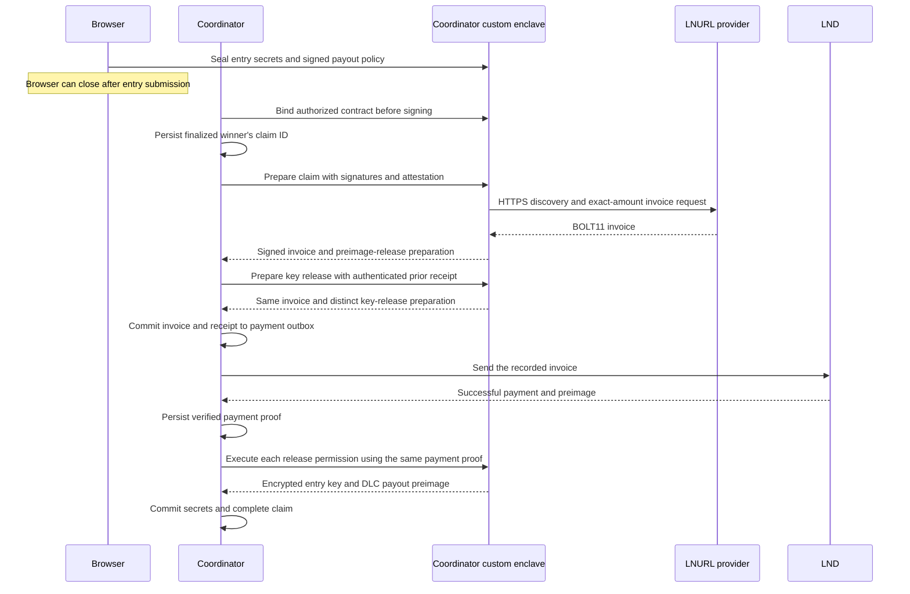

# Automatic Lightning Address payouts

New competitions can pay authorized winners without an open browser or a Claim request.
The coordinator queues the exact winnings after it verifies an oracle attestation.
The Coordinator verifier checks the Lightning payment proof inside the enclave.
Keymeld then executes the separately authorized key and preimage releases.

This implementation requires generic Keymeld escrow and the Coordinator custom enclave image.
Keymeld 0.4.1 does not provide these operations.
Do not enable the release workflow until the new coordinator, enclave, gateway, and browser artifacts pass integration checks.

## Authorization before ticket payment

Each entrant chooses a Lightning Address, invoice fallback, or both.
The browser checks the ticket invoice and obtains fresh enclave attestation before displaying the payment QR code.
The browser encrypts its existing entry key and payout preimage to that enclave.
Its possession signature covers the registration context and generic escrow registration.
A separate participant signature fixes the verifier, application rules, secret commitments, and each operation permission.

The policy fixes these values:

- Competition, entry, network, ticket hash, payout hash, and player slot.
- Oracle locking points, market maker, complete payout distribution, player count, pool, relative locktime, and fee ceiling.
- The Lightning Address, invoice fallback permission, and explicit consent to release both secrets after payment.

A profile edit applies to future authorizations.
It cannot change an accepted entry's payout address.
The wallet retains the existing `coordinator/entry-key/v1` and `coordinator/payout-preimage/v1` derivations.

Other player keys and the funding outpoint are unknown when an entrant buys a ticket.
The enclave therefore binds the complete contract later, before signing any message.
The complete contract must satisfy every participant's fixed economic policy.
The signed binding request includes every participant's accepted policy from durable storage.
The coordinator requires an authenticated binding response for every participant before it proceeds.
Omitting or replacing a policy fails the binding check.
The signing guard checks the full signature batch, signer sets, adaptor points, and tweaks.

For these competitions, NOAA submission IDs use the preallocated ticket UUIDs.
Local entry UUIDs remain unchanged.
Ticket order therefore defines both oracle outcome indices and contract player slots.
The leaderboard maps oracle IDs back to local entry IDs.
Existing competitions retain their original oracle identifiers.

## Payment and recovery



`PayoutWatcher` is the sole Lightning sender.
An unknown payment result keeps the existing invoice locked.
Only a definitive failure permits another live payment for that entry.
A global payment-hash index prevents one Lightning payment from satisfying two entries.

Preparation retries use the persisted claim ID.
A paid claim retries escrow release without requesting another invoice or sending another payment.
Invoice expiry does not invalidate recovery of an already successful payment.

Before each new payment, the coordinator checks that the outcome output remains unspent and confirmed.
It checks both the Electrum tip and a fresh, synchronized LND tip.
The payment route's total CLTV limit must end before the player's earliest on-chain claim.
The limit reserves twelve settlement blocks and one mempool block.
The limit shrinks as the chain advances and cannot exceed 144 blocks.
An invoice whose final CLTV requirement does not fit is not sent.

At the cutoff, the coordinator closes the Lightning payout window.
It rejects new claims and stops unsent outbox items after LND confirms that no payment exists.
Pending payments and successful claims awaiting escrow release must reconcile before the coordinator broadcasts its fallback transaction.
An HTTP timeout alone does not establish that a payment failed.

The chain check and Lightning send are separate operations.
The block margin limits ordinary timing races; it does not provide an atomic exchange across Bitcoin and Lightning.
Keep both chain backends synchronized and retain pending payments until LND reports a conclusive result.

## Invoice fallback

The invoice fallback signs the exact invoice digest, amount, contract digest, entry, session, claim ID, and authorization expiry.
The browser verifies the completed contract and attestation before signing.
It sends no raw entry key or DLC payout preimage.

A fallback may replace an automatic claim that has no queued payment.
It cannot replace an in-flight or successful payment.
The enclave applies the same contract, winner, amount, and payment-proof checks to both methods.

Legacy recovery is a separate, explicit choice for entries without escrow authorization.
It retains the earlier trust model: the user releases entry secrets before payment.
A missing authorization response never automatically selects legacy recovery.

## Operator configuration

Set these coordinator options before creating competitions:

```toml
[keymeld_settings]
enabled = true
automatic_payouts = true
automatic_payout_max_fee_rate_sat_vb = 100
```

The example omits existing gateway and attestation settings.
Keep their reviewed values.
The corresponding Helm keys are `keymeld.automaticPayouts` and `keymeld.automaticPayoutMaxFeeRateSatVb`.

Keymeld provides an application-independent `escrow` engine for conditional signing and explicit secret release.
Coordinator statically registers `coordinator.dlc` in its custom enclave image.
Build that image with the `lnurl` Cargo feature for automatic address resolution.
Set `COORDINATOR_ESCROW_LNURL_ENABLED=true` in the measured runtime configuration.
Run the separate Coordinator LNURL relay on the configured VSock port.
See [Coordinator enclave and relay](COORDINATOR_ENCLAVE.md) for build and deployment instructions.

Authorized clients query verifier capabilities through confidential transport.
The gateway does not publish application rules or inspect policies to negotiate support.
Unavailable capabilities reject ticket requests before a ticket invoice is issued.
Disabling new LNURL requests preserves release of already prepared, paid claims.

Enabling automatic payouts affects new competitions only.
Existing entrants did not authorize an escrow policy and cannot be enrolled by an operator after payment.

## Trust boundaries

The LNURL relay carries TLS ciphertext.
The enclave validates provider certificates and hostnames using enclave-owned roots.
It rejects redirects, credentials in URLs, private destinations, DNS rebinding, oversized responses, and unsupported mandatory payer data.

Invoice descriptions and LNURL metadata do not authenticate the recipient.
Recipient origin comes from enclave HTTPS or an entry-key signature over a fallback invoice.
These checks support both ordinary BOLT11 description forms.
See [LUD-06](https://github.com/lnurl/luds/blob/luds/06.md), [LUD-16](https://github.com/lnurl/luds/blob/luds/16.md), and [LUD-18](https://github.com/lnurl/luds/blob/luds/18.md).

A Lightning payment preimage proves possession of the invoice secret.
The provider can disclose that secret without receiving a payment.
Participants therefore trust their chosen provider not to collude with the coordinator.

Sealed receipts authenticate restart state but do not prevent a hostile host from restoring an older database and enclave state.
The current restoration system has no external monotonic counter.
The enclave claim ledger does not span separate enclaves or survive a hostile rollback.
The coordinator must retain its durable global payment-hash index across restarts.
Immutable recipient and economic policies remain enforced after restoration.
Do not describe the receipts as cryptographic rollback protection.

After verified payment, the coordinator stores the purchased entry key and DLC payout preimage for settlement.
Protect database backups and filesystem access accordingly.

## Invoice renewal and late payment proofs

The participant signs two independent release grants. Each grant permits renewable preparation of the identical release action and one successful execution.
A renewed invoice uses a new claim and the authenticated predecessor preparation receipt.
The signing-key preparation also carries the current claim's preimage preparation, so both permissions refer to the same invoice.
The verifier rechecks the authorized contract, amount, network, and invoice recipient for each new candidate.

Reconcile the previous payment before requesting another invoice. Retain earlier receipts for late paid proofs.
The first successfully executed candidate fixes each release grant; competing candidates cannot execute it afterward.
Retrying the successful candidate recovers its result without another LNURL lookup.
These rules do not turn sealed state into a durable antirollback witness.
