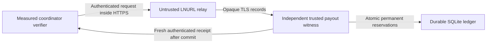

# Durable payout uniqueness

The payout witness preserves payment-hash ownership and entry-release ownership across enclave restarts.
It replaces the verifier's permanent 4,096-entry memory ceiling with indexed SQLite storage.
Neither completed payments nor expired invoices delete ownership evidence.

Production uses a separate trusted service and the `coordinator-verifier-enclave-lnurl` artifact for enclave HTTPS transport.
The fake-money lab can use the explicit `coordinator-verifier-enclave-simulation` artifact with a shared local SQLite ledger.
The default artifact without either transport refuses startup.
Missing witness configuration stops enclave startup.
Missing or unauthenticated witness responses refuse preparation, execution, and receipt restoration.
There is no production memory fallback.



## Fresh start for the simulated lab

The lab runs three simulated TCP enclaves under one trusted host.
Local witness mode reuses the same transactional ledger without an HTTPS service or shared authentication secret.
All three processes must open the same database and pin the same ledger UUID.
This mode requires the `payout-witness-local` build feature and both explicit development settings shown below.
Nitro and default artifacts cannot select it.

The lab owner authorized abandoning previous fake-money claims and starting fresh.
A complete reset replaces the historical inventory requirement for that deployment.
An enclave restart alone is insufficient because the gateway database retains encrypted enclave identities.

Before initialization:

1. Stop synthetic scheduling, rebalancing, and old competition admissions.
2. Stop both coordinator, synth, and Keymeld slot containers and prevent automated restart during the reset.
3. Stop the relevant Litestream writers, restore units, and database export jobs.
4. Archive the old application state listed below, including SQLite WAL, SHM, and local Litestream metadata.
5. Retire the old enclave encryption and gateway command keys.
6. Select new backup prefixes so startup cannot restore the abandoned databases.
7. Initialize a new witness database once, then pin its printed UUID in every verifier.
8. Start fresh Keymeld identities, coordinator state, and synth state in that order.

| State to retire | Current lab host path |
| --- | --- |
| Competitions, payout claims, entry registrations, and confidential command journal | `/srv/apps/coordinator/data/competitions.db` |
| Gateway sessions, pending commands, and encrypted enclave identities | `/srv/apps/keymeld/keymeld.db` |
| Simulated KMS master key | `/srv/apps/keymeld/secrets/kms-master.key` |
| Gateway command signing key | `/srv/apps/keymeld/secrets/gateway-channel.key` |
| Synthetic runs, trails, users, and payment intents | `/srv/apps/synth/data/synth.db` |

Keep retired files outside active service paths and automatic restore prefixes.
Coordinator accounts and its Oracle-authorized signer can remain; they are separate from the retired enclave signing keys.
Oracle weather history and Lightning wallets do not need deletion.
Old fake-money claims are abandoned rather than imported into the new ledger.

The explicit initialization command refuses every existing database file:

```sh
coordinator-payout-witness initialize-empty /var/lib/keymeld/payout-witness/ledger.sqlite --acknowledge-fresh-epoch
```

Run it as the service account after creating its protected state directory.
It generates a new UUID and prints `PAYOUT_WITNESS_LEDGER_ID=<uuid>` after committing the empty ledger.
It never reuses an old UUID or deletes existing data.
The acknowledgment records the operator's declaration; the command does not perform or verify the external reset.

Configure each simulated verifier:

```sh
export TRANSPORT_MODE=tcp
export KEYMELD_DANGEROUS_TRUST_UNATTESTED_ENCLAVES=true
export COORDINATOR_PAYOUT_WITNESS_MODE=local-simulation
export COORDINATOR_PAYOUT_WITNESS_DATABASE=/var/lib/keymeld/payout-witness/ledger.sqlite
export COORDINATOR_PAYOUT_WITNESS_LEDGER_ID='replace-with-printed-uuid'
```

Replace the UUID placeholder with the printed value.
Do not set HTTPS URL or key-file settings in local mode; mixed configuration is rejected.
Startup refuses absent databases and mismatched identities.
`run-keymeld` uses the simulation artifact and requires an initialized absolute database path and ledger UUID.
It starts the relay when automatic LNURL or HTTPS witness transport needs it.

The simulation release archive includes the verifier, relay, and `coordinator-payout-witness` initializer.
Its name is `coordinator-verifier-enclave-simulation-VERSION-TARGET.tar.gz`.
The normal enclave release remains a separate artifact without local witness support.

Local storage trusts the same host as the simulated enclaves.
Its SQLite constraints prevent conflicting reservations across processes; storage contention returns a retryable unavailable result.
Retain the ledger across normal restarts. A missing ledger never triggers another fresh start.
After another deliberate full lab reset, initialize a different ledger identity.

## Production trust and deployment requirements

Run the witness under an administrative principal independent from the coordinator gateway and relay.
Protect its database, backups, authentication key, and HTTPS endpoint under that principal.
The witness administrator becomes a trusted authority for payout uniqueness.

Provision the 32-byte authentication key confidentially into the witness and enclave.
Do not package this secret in a public enclave image or expose it through relay configuration.
The application reads a protected key file containing 64 hexadecimal characters.
This repository does not implement confidential Nitro secret provisioning for that file.
Provide that mechanism before activating this change.

Expose the witness through a fixed, publicly routable HTTPS origin with a publicly trusted certificate.
The existing enclave HTTPS transport rejects private addresses, invalid certificates, and redirects.
The relay cannot inspect or replace authenticated reservation requests.
Request and receipt authentication use separate HMAC-SHA256 domains.
Each receipt binds the full request, ledger identity, and a fresh 256-bit challenge.

SQLite uses write-ahead logging and synchronous FULL commits.
Persist the database and its write-ahead log on reliable storage.
Do not run independent writable copies of one ledger identity.
HMAC authentication does not detect rollback by the trusted witness administrator.
Before restoring a backup, reconcile every commitment made after that backup.
Keep the service unavailable until that reconciliation is complete.

## Migration that preserves existing claims

The old verifier has no durable, complete anti-reuse journal.
Its sealed execution receipts cover completed releases; those receipts do not prove a complete inventory of previously prepared hashes.
A database export alone cannot prove that an untrusted gateway supplied every historical claim.

Before migration, stop new payout preparations and reconcile in-flight outcomes.
Collect every prepared payment hash, including failed routes and expired invoices.
Collect every released entry's claim identity from authenticated execution evidence.
Reconcile all verifier instances and retained execution receipts.
If complete historical evidence is unavailable, do not migrate existing claims into a replacement witness.
An empty ledger requires a new deployment epoch, including the authorized full lab reset described above.

The trusted administrator supplies a complete inventory as newline-delimited JSON.
The first line declares the pinned ledger UUID and the complete-history checkpoint.
Each remaining line contains a reservation using the shared `payout_witness::Reservation` schema.
The checkpoint is an explicit operator trust assertion; it is not cryptographic proof of completeness.

```json
{"ledger_id":"01920000-0000-7000-8000-000000000001","complete_history_checkpoint":"operator-reviewed complete inventory at the paused migration checkpoint"}
{"claim":{"session_id":"01920000-0000-7000-8000-000000000002","user_id":"01920000-0000-7000-8000-000000000003","claim_id":"01920000-0000-7000-8000-000000000004"},"payment_hash":[1,1,1,1,1,1,1,1,1,1,1,1,1,1,1,1,1,1,1,1,1,1,1,1,1,1,1,1,1,1,1,1],"executing":true}
```

Set `executing` to true for authenticated completed release ownership.
Include historical unpaid preparations with `executing` set to false.
The importer retains those hashes even when another claim later released the entry.
Conflicting hash ownership or conflicting completed release ownership aborts the import.
An existing database cannot be initialized again.
An interrupted import cannot serve requests.

After reviewing the complete inventory, initialize a new protected database:

```sh
coordinator-payout-witness initialize-from /var/lib/payout-witness/ledger.sqlite /secure/complete-inventory.jsonl
```

## Configuration

The package is available as the `coordinator-payout-witness` Cargo package and Nix flake output.
Production requires the existing `lnurl` HTTPS feature, including when automatic LNURL payments are disabled.
This feature name controls the shared relay transport.

| Process | Setting | Purpose |
| --- | --- | --- |
| Witness | `PAYOUT_WITNESS_KEY_FILE` | Protected shared authentication key file. |
| Witness | `PAYOUT_WITNESS_LISTEN` | HTTP listener behind HTTPS; defaults to `127.0.0.1:8182`. |
| Enclave | `COORDINATOR_PAYOUT_WITNESS_MODE` | Defaults to `https`; `local-simulation` requires the dedicated build and development guards. |
| Simulated enclave | `COORDINATOR_PAYOUT_WITNESS_DATABASE` | Absolute path to an initialized local ledger. |
| Enclave | `COORDINATOR_PAYOUT_WITNESS_URL` | Fixed endpoint ending in `/v1/reservations`. |
| Enclave | `COORDINATOR_PAYOUT_WITNESS_LEDGER_ID` | UUID from the reviewed inventory or explicit fresh initialization. |
| Enclave | `COORDINATOR_PAYOUT_WITNESS_KEY_FILE` | Confidentially provisioned authentication key file. |
| Enclave | `COORDINATOR_LNURL_RELAY_PORT` | Existing relay port; defaults to `8101`. |

Start the initialized witness after setting its protected service environment:

```sh
coordinator-payout-witness serve /var/lib/payout-witness/ledger.sqlite
```

Serving never creates or initializes a missing database.
The API admits at most 32 handlers and uses one database connection.
Requests have an 8-KiB body limit.
The enclave bounds the complete HTTPS request to 15 seconds.
Configure connection and header limits at the witness's HTTPS proxy.

## Failure handling and occupancy

`/metrics` reports persistent payment-hash and released-entry counts from the ledger.
It also reports process counters for storage-capacity failures and unavailable storage.
Expose this endpoint only to the monitoring network.

Reservations return typed `Conflict`, `Capacity`, `Unavailable`, and `WrongLedger` outcomes.
The verifier also distinguishes absent configuration and unauthenticated receipts internally.
Keymeld's existing verifier interface converts these failures into validation errors.
No Keymeld custody implementation changes are required.

If a response is lost, retry the same authenticated claim and payment hash.
A committed reservation is idempotent for that owner.
If storage fills, expand or repair durable storage before retrying.
During recovery of an existing deployment, do not clear rows, change its identity, or restart with an empty ledger.

The verifier keeps no historical cache.
Its memory use does not grow with previous payouts.
Witness storage grows with permanent uniqueness evidence and requires capacity monitoring.

## Validation limits

The change includes focused regressions for more than 4,096 hashes, concurrent conflicting owners, restart recovery, missing databases, and receipt authentication.
It also includes a verifier regression that refuses unconfigured preparation, execution, and restoration.
No builds, checks that compile Rust, or test executions were performed for this change.
Fresh-lab activation requires the complete reset, matching simulation artifacts, an initialized ledger, and its pinned UUID.
Production activation still requires confidential secret provisioning and an independently administered witness.
Historical reconciliation applies only when retaining claims from an existing deployment.
No live state was reset or deployed while preparing these changes.
